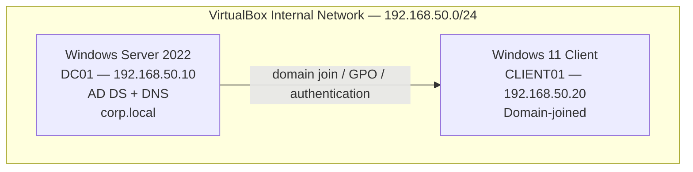

# Active Directory Lab — Corporate Helpdesk Simulation

A simulated small-business Active Directory domain, built to practice real Windows Server / AD administration, Group Policy, and helpdesk-style incident troubleshooting — including a full account-lockout incident diagnosed and resolved end to end.

**Status:** ✅ Complete

## Overview

A domain controller (`corp.local`) manages a small OU structure (Sales, IT, Management) with per-department Group Policy, verified against real domain-joined Windows 11 clients. The centerpiece of this lab is a simulated real-world incident — a Sales user account getting locked out — diagnosed using Windows Event Viewer and resolved the way a Tier 1/2 helpdesk ticket actually gets worked.

## Architecture

**OU structure:**
- `corp.local`
  - `Sales` — GPO: Prohibit access to Control Panel and PC settings; also home of the `Sales Users` security group with a Fine-Grained Password Policy
  - `IT` — GPO: Prevent access to the command prompt
  - `Management` — GPO: Hide the C: drive in File Explorer

**Test accounts:**
| User | OU | Purpose |
|---|---|---|
| `jdoe` (John Doe) | Sales | GPO + incident test account |
| `falex` (Fredrick Alexander) | IT | GPO test account |
| `bwilliams` (Bob Williams) | Management | GPO test account |

## What was built

1. **Domain controller** — Windows Server 2022 Standard (Desktop Experience), promoted to the first domain controller of a new forest, `corp.local`, with AD DS and DNS roles.
2. **OU structure and users** — three department OUs, each with a test user account.
3. **Group Policy, verified against a real client** — three distinct department-level restrictions, each confirmed working by logging in as the actual affected user:
   - **Sales** → Control Panel blocked (`"This operation has been cancelled due to restrictions in effect on this computer. Please contact your system administrator."`)
   - **IT** → Command Prompt blocked (`"The command prompt has been disabled by your administrator."`)
   - **Management** → C: drive hidden from File Explorer (only optical drive visible under "This PC")
4. **Domain-joined Windows 11 client** — `CLIENT01`, joined to `corp.local`, used to test and verify all of the above from a real end-user perspective.
5. **Full incident simulation** — see below.

## Incident: Sales user account lockout

Full STAR-format writeup: [`docs/ticket-writeup.md`](ticket-writeup.md)

Short version: a Fine-Grained Password Policy was applied to a `Sales Users` security group (lockout after 2 failed attempts). The `jdoe` account was intentionally locked out, then diagnosed using Windows Event Viewer on the domain controller (Event ID 4740 — Account Lockout, and Event ID 4625 — Logon Failure), root-caused, and fixed by unlocking the account in Active Directory Users and Computers. A real troubleshooting detour is documented too: account-lockout auditing wasn't enabled by default and had to be turned on via Group Policy, and the first investigation attempt failed because Event Viewer was being checked on the client instead of the domain controller — a genuine lesson about where different security events get logged in a domain environment.

## Screenshots

See [`Screenshots/`](Screenshots/) for the full set, including:
- Server Manager confirming AD DS/DNS roles installed and DC01 online
- Active Directory Users and Computers — OU structure and test users
- Group Policy Management — all three OUs with linked GPOs
- Each GPO's enforcement proven live (Control Panel blocked, Command Prompt blocked, C: drive hidden)
- Client successfully joined to the domain
- The account-lockout failure screen
- Event Viewer evidence (Event ID 4740 and 4625) with full account/computer detail
- The account unlocked and successful login afterward

## Skills demonstrated

Windows Server 2022 administration, Active Directory Domain Services, Group Policy Objects (creation, linking, per-OU enforcement, verification against real clients), DNS, Fine-Grained Password Policies, Windows audit policy configuration (`auditpol`, Advanced Audit Policy Configuration), Event Viewer log analysis and filtering, domain join/client administration, systematic incident troubleshooting.

## Resume bullets

- Deployed a Windows Server 2022 Active Directory domain controller with structured OUs and Group Policy Objects enforcing per-department Control Panel, Command Prompt, and drive-visibility restrictions — verified enforcement against real domain-joined clients.
- Configured a Fine-Grained Password Policy with an aggressive account-lockout threshold, then diagnosed a simulated lockout incident by correlating Windows Event Viewer logs (Event ID 4740, 4625) across the domain controller and client, tracing root cause and restoring user access.
- Troubleshot a missing audit-logging gap during incident investigation — identified that account-lockout auditing wasn't enabled by default, corrected the audit policy via Group Policy and `auditpol`, and verified logging end-to-end.
- Joined Windows 11 workstations to an Active Directory domain and validated Group Policy enforcement across multiple Organizational Units with distinct department-specific restrictions.

## Lessons learned

- "Logon hours" is not a Group Policy setting — it's a per-user AD account property. Real GPO-based restrictions (Control Panel, Command Prompt, drive visibility) had to be used instead for department-level policy.
- Account-lockout auditing (Event ID 4740) is not enabled by default — it requires explicitly turning on the "Audit Account Lockout" subcategory under Advanced Audit Policy Configuration (found under **Logon/Logoff**, not the more intuitively-named **Account Management** category).
- Different Windows security events are logged on different machines depending on what they represent: local logon failures show up on the machine being logged into, but domain account-lockout decisions and their 4740 events are only logged on the domain controller, since that's the authoritative source for the account's state.
- `auditpol /get /subcategory:"..."` is a fast, authoritative way to check the *actual effective* audit policy on a machine, rather than trusting the Group Policy editor alone.
